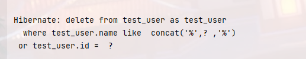

# 开发空间站
目前更新至0.0.3 版本，版本详情见文末。
注0.0.3版本还未稳定，预计将在0.0.4版本稳定
## 简介
* 总结自己在开发过程中，遇到的一些问题，并将这些问题归集分析后， 得出的一些解决方案， 并开发成比较方便使用的注解；
* 本项目会持续更新，追加一些新的功能或优化完善已做好的功能；
* 如有更好的建议，或需要改进的部分，请各位大神能够多多指导；


## 目录
* 开始使用
* 验证器
* 事件驱动引擎
* DtoQuery
* 待开发内容
* 版本更新详情

## 使用方式
1. 引入maven
    ```
        <dependency>
            <groupId>io.github.leeoohoo</groupId>
            <artifactId>space-station-spring-boot-starter</artifactId>
            <version>0.0.1</version>
        </dependency>
    ```
2. 开启注解扫描 @EnableHappenProxy
    ```java
    /**
     * @author 17986
     */
    @SpringBootApplication
    @EnableHappenProxy
    @EnableFeignClients
    public class ScaffoldApplication {
    
        public static void main(String[] args) {
            SpringApplication.run(ScaffoldApplication.class, args);
        }
    
    }
    
    ```
3. 目前只有线程池bean 名的配置,在yml 中末尾添加即可
    ```
   station:
       task-executor-name: asyncTaskExecutor
   ```

## 验证器 @MyValidate 
该注解是基于 spring-boot-starter-validation 进行的二次封装，在原有的功能上，支持自己编写自己的验证逻辑，封装该注解的目的在于我发现很多验证的
逻辑会严重污染我们的正常的业务逻辑，于是尝试将数据验证的逻辑拆分出来，下面是代码示例：
```java
@Data
public class UserDto {

    @MyValidate(groupSize = 2,groupName = "nameAndIdCard",verify = NameAndIdCardValidate.class, message = "名字和身份证组合校验重复了")
    private String name;

    @MyValidate(groupSize = 2,groupName = "nameAndIdCard",verify = NameAndIdCardValidate.class, message = "名字和身份证组合校验重复了")
    private String idCard;

    @NotBlank(message = "不能为空")
    @MyValidate(verify = JobValidate.class, message = "工作的其他校验未通过")
    private String jobs;

    

    @MyValidate(verify = AgeValidator.class,message = "请输入年龄")
    private Integer age;


    @MyValidate(verify = DressValidate.class,message = "请输入地址")
    private String dress;


    public static class AgeValidator implements SingleValidate<Integer> {
        @Override
        public boolean validate(Integer obj) {
            if(obj>150 || obj <0) {
                return false;
            }
            return true;
        }
    }

    public static class DressValidate implements   SingleValidate<String>  {
        public boolean validate(String obj) {
            return true;
        }
    }


}

```
```java
@Verify
public class JobValidate implements SingleValidate<String> {
    private final UserService userService;

    public JobValidate(UserService userService) {
        this.userService = userService;
    }

    /**
     * 自己的校验逻辑
     * @param obj 是DTO中注解的字段的相应的值
     * @return
     */
    @Override
    public boolean validate(String obj) {
        System.out.println("测试");

        return true;
    }
}
```
```java
@Verify
public class NameAndIdCardValidate implements GroupValidate {

    /**
     * 
     * @param map key 就是字段的名称，value 就是值，在下面自己的逻辑中自取验证的字段的值进行组合验证
     * @return
     */
    @Override
    public boolean validate(Map<String, Object> map) {
        System.out.println(map);
        return true;
    }
}
```
使用时需要注意：
* 当需要注入其他服务的代码时，不能将验证器以内部类的方式写到DTO中，需要单独建立一个文件；
* 支持单个和分组校验，分组校验时需要额外标注分组名称和分组的size, 后期会尝试简化这部分内容；
* 可以在一个字段上添加多个注解，和原生的注解也可以组合使用

# 事件驱动引擎 @Happen @Trigger
* @Happen 标注到事件发生的方法上；
* @Trigger 标注到接收事件发生的方法上；

在开发过程中，有时会遇到如下几个场景可以使用本组注解:
* 在修改某一对象的状态值时，其他地方需要做相应的改变时；
* 对数据做流程是处理时；

以下为使用示例：
```java
/**
 * @Description:
 * @Author: leeoohoo@gmail.com
 * @CreateTime: 2022/8/3
 */
@Service
@Slf4j
public class UserService {


    @Autowired
    private   UserRepository userRepository;


    @Happen("userSaveOrUpdate")
    @Transactional(rollbackFor = Exception.class)
    public String saveOrUpdate(UserDto userDto, String uuid){
        User user = new User();
        BeanUtils.copyProperties(userDto,user);
        userRepository.save(user);
        return "我返回的结果";
    }


    @Trigger(value = "validate",happenName = "userSaveOrUpdate",order = 1)
    @Transactional(rollbackFor = Exception.class)
    public String validatePassword(String result , UserDto userDto, String uuid){
        log.info("---------------------验证密码");
        // 如果此方法的入参没有遵循默认的（事件发生的返回值 ， 事件发生的入参顺序）入参顺序，
        // 则可以通过线程变量获取事件发生的返回值和入参的值
        Object resultThreadLocal = EventThreadValue.getResultThreadLocal();
        log.info(EventThreadValue.getParamsThreadLocal().toString());
        log.info("result:{}, user:{}, uuid:{}",result, userDto, uuid);
        if(null != resultThreadLocal) {
            log.info(resultThreadLocal.toString());
        }
        // 可以用取到的值进行其他操作
        User user = new User();
        BeanUtils.copyProperties(userDto,user);
        userRepository.save(user);
        return "测试";
    }


    @Trigger(value = "test",happenName = "userSaveOrUpdate",order = 2)
    @Transactional(rollbackFor = Exception.class)
    public void test( String result ,UserDto user,String uuid){
        Object validate = EventThreadValue.getStepResultThreadLocal("validate");
        log.info("我是测试---------------------");
        Object resultThreadLocal = EventThreadValue.getResultThreadLocal();
        log.info(EventThreadValue.getParamsThreadLocal().toString());
        log.info("result:{}, user:{}, uuid:{}",result, user, uuid);
        if(null != resultThreadLocal) {
            log.info(resultThreadLocal.toString());
        }
        log.info("我是测试---------------------");

    }

    @Trigger(value = "boo",happenName = "boo")
    public void booTrigger() {
        System.out.println("我走到boo");
    }
}

```
```java
/**
 * @Description:
 * @Author: leeoohoo@gmail.com
 * @CreateTime: 2022/8/8
 */
@Slf4j
@Service
public class TriggerTest {
    private final  UserRepository repository;

    public TriggerTest(UserRepository repository) {
        this.repository = repository;
    }


    @Trigger(value = "test",happenName = "userSaveOrUpdate",async = true)
    @Happen("boo")
    public void test(String result , UserDto user, String uuid) throws InterruptedException {
        User user1 = new User();
        BeanUtils.copyProperties(user,user1);
        repository.save(user1);
        log.info("我是另一个测试---------------------");
        Thread.sleep(5000);
        log.info("我睡了一会");
        Object resultThreadLocal = EventThreadValue.getResultThreadLocal();
        log.info(EventThreadValue.getParamsThreadLocal().toString());
        log.info("result:{}, user:{}, uuid:{}",result, user,uuid);
        if(null != resultThreadLocal) {
            log.info(resultThreadLocal.toString());
        }
    }
}

```
实现RecordAbstract接口,重写可以拿到事件发生器与事件接收器执行过程中的记录
```java

public class TestRecord implements RecordAbstract {
    @Override
    public void saveTrigger(CirculationRecord circulationRecord) {
        System.out.println("测试是否可以拿到数据");
        System.out.println(circulationRecord.toString());
    }

    @Override
    public void saveHappen(CirculationRecord circulationRecord) {
        System.out.println("测试是否可以拿到数据");
        System.out.println(circulationRecord.toString());
    }
}
```
别忘了通过@Bean注入到ioc中
```
    @Bean
	public RecordAbstract getRecordAbstract() {
		return new TestRecord();
	}

```

使用注意：
* 事件接收器的方法的类确保被spring IOC管理，且暂不支持Interface的方式
* 事件接收器的方法入参推荐顺序为 “事件发生方法的返回参数”， ”事件发生方法的入参顺序"，这样的话注解会自动将事件发生器的入参赋值；
* 事件接收器同时也可以成为事件发生源，例如
    ```
    
        @Trigger(value = "test",happenName = "value",async = true)
        @Happen("boo")
        public void test(String result , UserDto user, String uuid) throws InterruptedException {
            User user1 = new User();
            BeanUtils.copyProperties(user,user1);
            repository.save(user1);
            log.info("我是另一个测试---------------------");
            Thread.sleep(5000);
            log.info("我睡了一会");
            Object resultThreadLocal = EventThreadValue.getResultThreadLocal();
            log.info(EventThreadValue.getParamsThreadLocal().toString());
            log.info("result:{}, user:{}, uuid:{}",result, user,uuid);
            if(null != resultThreadLocal) {
                log.info(resultThreadLocal.toString());
            }
        }
    ```
    以上片段作为事件的接收者，接收userSaveOrUpdate的事件的同时，又发起了 "boo"的事件。
    ```
        @Trigger(value = "boo",happenName = "boo")
        public void booTrigger() {
            System.out.println("我走到boo");
        }
    ```
    由以上方法接收，入参可以遵从上文说过的顺序，也可以没有参数，从线程变量中获取。
* 事件接收器支持事物（TransactionDefinition.PROPAGATION_REQUIRES_NEW），目前仅支持开启新的事物，后续可以继续跟@Transactional做深入兼容；
* 如事件接收器是异步的情况下，可以在配置文件中配置自己的线程池的名称，如未配置则默认不使用线程池；
* 异步情况下，忽略事物，同时会在所有同步事件接收器执行完毕以后，开始执行所有异步执行器;
* 事件接收器会根据配置 "order" 自然排序顺序执行
* EventThreadValue.getStepResultThreadLocal("validate") 可以根据线程变量获取已经执行过的事件接收器的返回参数

# DTOQuery
## 目录
* 前言
* 对比
* 使用方法
* 前景展望


## 前言
第一次发表这么正式的博客，内心还是有点忐忑。首先感谢正在阅读本文的大家，如有写的不对的地方，还请大家海涵，如能不吝赐教那就更加感谢了。

本博文主要是想介绍一下本人开发的“DTOQuery”一款ORM框架，其实不能说是ORM框架，主要还是站在现在主流的ORM框架的基础上进行开发，
主要目的是减少学习曲线，并加速开发的效率。当然以上也只是我自己觉得，是否真的达到了这样的效果，或者说在未来能否能达到这样的效果，
还要请各位多多的赐教了，这里我先抛砖引玉。

其次目前只对mySql 进行了实现，也预留了其他数据库的实现接口，后续有时间我会在实现几个常用的数据库。
## 对比
我们主要对比的是现目前使用比较多的两款主流的ORM 框架，一个是MyBatis Plus，还有一个是JPA。

首先我要声明的是这里的对比并不是比一个高低，只是将我在工作中日常看到的代码拉出来看一下，本人也是站在这两款ORM框架的肩膀上进行开发的。我也是基于工作中这些现象，才决定开发一款这样的一款工具包来简化工作中的一些不必要的代码。

那下面我直接上图

当我们用Mybatis Plus实现一些相对复杂的sql时，就需要自己到XML中自己写一下sql了，并且像一些可以为空的条件就要去写一些if 标签，其实这种代码多了，属实也是挺崩溃的。


以上是在java 文件里加的一些判断，看着也是非常的冗长和麻烦，我们在开发一个简单的多条件查询的时候，尽然还要这么费事费时吗，有没有办法简化来提高我们效率，答案是肯定的。

以上我们看到是Mybatis Plus的个例，下面我们来看看JPA的


```java
public class Test {
    @RequestMapping("/user/list.do")
    public  ResponseBean getUserList(){
        QSysUser qsysuser = QSysUser.sysUser;
        QSysRole qsysrole = QSysRole.sysRole;
        QSysUserRole quserrole = QSysUserRole.sysUserRole;

        QBean<ItemsBean> bean = Projections.bean(
                ItemsBean.class,
                qsysuser.id,
                qsysuser.username,
                qsysuser.pwd,
                qsysrole.title,
                quserrole.roleId
        );

        // 左联三张表 并对id进行排序
        List list =  jpaQueryFactory.select(bean).from(qsysuser)
                .leftJoin(quserrole).on(qsysuser.id.eq(quserrole.userId))
                .leftJoin(qsysrole).on(quserrole.roleId.eq(qsysrole.id))
                .orderBy(qsysuser.id.asc()).fetch();

        return new ResponseBean(200,null,list);
    }
}

```

以上是JPA 的示例代码，可以看出在处理多条件查询的时候，几乎是差不多的处理手法，在做表连接时也是相当的麻烦。

为了提高开发的效率，将这些琐碎的参数处理，链表处理更方便，更易懂的方式展现出来，于是我开发了DTOQuery。

# 使用方法
终于进入了主题，我上面说了一大堆，那么到底这个该怎么用呢？接下来我将详细的将给大家听，同时我将自己基于DTOQuery 来实现一个个人主页的项目来进一步测试，后续代码也会公开在github 上以供参考。

首先分享一下源码的地址和maven 中央库的地址

maven: https://search.maven.org/artifact/io.github.leeoohoo/space-station-spring-boot-starter/0.0.3/jar

github: https://github.com/leeoohoo/space-station-spring-boot-starter

注意DTOQuery 在第三个版本后才支持的，前两个版本做的内容在github 上有详细的描述，有感兴趣的伙伴也可以看看。

查询主要分为两种方式，一种的通过在DTO上添加注解，最终生成sql，最终交给jpa 进行执行，还有一种是链式调用，主要针对相对复杂的查询环境，支持常用的SQL 函数。这里我稍微插一句题外话，我认为随着微服务的发展，我们逐渐的将较为复杂的业务分为多个服务去执行，所以在数据库层也慢慢的简化，所以sql 大部分情况下就不会那么的复杂，而DTOQuery就是为了那些大部分不是特别复杂的SQL而生。

* ## DTO模型查询
当我们有一天看到我们的DTO 就知道这个接口的查询逻辑，想要加一个搜索条件或减少一个搜索条件也只要加减个字段，那该多好啊，甚至可以定义一些必填的搜索条件等等，是不是听下来还不错？

接下来我们就开始告诉大家，DTOQuery 到底怎么用！
### 引入
```xml
<dependency>
    <groupId>io.github.leeoohoo</groupId>
    <artifactId>space-station-spring-boot-starter</artifactId>
    <version>0.0.3</version>
</dependency>


```
```xml
<dependency>
    <groupId>io.github.leeoohoo</groupId>
    <artifactId>space-station17-spring-boot-starter</artifactId>
    <version>0.0.3</version>
</dependency>
```
第一步我们需要在pom 文件中添加jar 的引用，以上一个是支持JDK1.8的版本，一个是支持JDK17的版本（目前JDK17的还没有上到maven中心库，我会根据JDK17 来实现一个
个人主页的项目，并使用DTOQuery这个工具包来作为数据库的实现，并会在过程中将一些出现的bug修复，最后将JDK1.8 的版本一同修复后更新一个版本）

### 主要对象

```java
@RestController
public class Test {


    @Autowired
    private Butler butler;

    @GetMapping("test")
    public void test() {


        TestUserDTO testUserDTO = new TestUserDTO();
        testUserDTO.setAge((short) 1);
        testUserDTO.setName("龙傲天");
        testUserDTO.setJob("IT");
        butler.insert(testUserDTO);

        // 批量插入
        List<TestUserDTO> list = new ArrayList<>();
        for (int i = 0; i < 1000; i++) {
            TestUserDTO testUserDTO1 = new TestUserDTO();
            testUserDTO1.setAge((short) 1);
            testUserDTO1.setName("龙傲天");
            testUserDTO1.setJob("IT");
            list.add(testUserDTO1);
        }

        butler.insertBatch(list,50);

        //链式sql
        CdnManager eq = EQ.find(TestUser.class)
                .select(TestUser.class)
                .where().eq(TestUser::getName, "龙傲天");

        List<TestUser> testUsers = butler.findList(eq, TestUser.class);


        CdnManager test = EQ.find(TestUser.class)
                .select(TestUser::getName,TestUser::getJob)
                .select(EF.abs(TestUser::getAge))
                .where()
                .like(TestUser::getJob, "test");

        EPage<TestUserDTO> page = butler.findPage(test, TestUserDTO.class, 10, 1);
        System.out.println(testUsers);

        //模拟前端传的搜索条件
        OrderDTO orderDTO = new OrderDTO();
        orderDTO.setName("一个大大的订单");
        orderDTO.setUserName("龙傲天");
        EPage<OrderDTO> page1 = butler.findPage(orderDTO, 1, 10);
        System.out.println(page1);

    }
}


@Data
@From(TestOrder.class)
@Join(fromClazz = TestOrder.class,fromField = "userId",joinClazz = TestUser.class,joinField = "id")
public class OrderDTO implements DTO {

    private Long id;

    @LikeRight
    private String name;

    private String code;

    @Eq
    @JoinColumn(joinClass = TestUser.class,columnName = "id")
    private Long userId;
    @LikeRight
    @JoinColumn(joinClass = TestUser.class,columnName = "name")
    private String userName;

    private BigDecimal price;
    

}
```

* ### Butler

是sql执行的核心实现，目前实现了jpa的集成，后期升级后可以通过配置文件来选择使用哪一种实现比如说 jdbc myBatis 等（美好的遐想）
用注入的方法引入到需要使用的当前类中，其中包含以下方法


通过点的方式都可以看到，里面的参数后面会详述，代码中也有相应的注释（应该有吧，没有我去补一下）。

* ### EQ

是sql 生成对外开发的静态方法类，他的使用方法可以看上面代码块中的使用方式，通过链式调用的方式，
用陈述句的方式来生成一个我们要的sql,链式调用的方式支持相对复杂的sql,在后面会详述。


* ### EF


是sql函数生成的静态方法类，里面支持了丰富的sql 函数，通过点的方式都可以看到，每个函数的功效也都在方法上注明（这个注释肯定写了）。


* ### SelectColumn<T,?>

实现lambda的方式传递field


红线框出来的地方就是接受SelectColumn对象（类似这样 Test::getAge），目的是减少String 类型的传参避免失误率，同时可以有效的防止sql 注入。

* ### DTO

所有的"DTO"的超类，后续在使用时通过这个超类来限制传参，没有实现DTO 的会出现编译错误

#### 最后看一下上面代码执行日志


### 新增

下面我们来具体看一下新增数据时怎么使用。
```
        // 插入单个
        TestUserDTO testUserDTO = new TestUserDTO();
        testUserDTO.setAge((short) 1);
        testUserDTO.setName("龙傲天");
        testUserDTO.setJob("IT");
        
        butler.insert(testUserDTO);

        // 批量插入
        List<TestUserDTO> list = new ArrayList<>();
        for (int i = 0; i < 1000; i++) {
            TestUserDTO testUserDTO1 = new TestUserDTO();
            testUserDTO1.setAge((short) 1);
            testUserDTO1.setName("龙傲天");
            testUserDTO1.setJob("IT");
            list.add(testUserDTO1);
        }

        butler.insertBatch(list,100);
```

使用时就是以上代码，批量插入时，支持输入批次号（我能说懂得都懂嘛）。 需要注意的点是只能传入实现了DTO 的对象，不是实例。
当然如果我们在实例中也实现DTO，同时添加@From注解也是可以的，但是不推荐这样做，我这样做的原因主要是想规范代码，不要用
实例直接去作为接口接受的参数。

同时我们同样支持在新增是动态的帮助大家添加创建人啊，创建时间等这些字段，不过需要添加以下配置
```java

/**
 * @author Lei Li. leeoohoo@gmail.com
 * @Description
 * @since 11 一月 2023
 */
@Component
public class DTOQueryIntercept {

    @Bean
    public CreateByInit getCreateByInit() {
        return new CreateByInit() {
            @Override
            public Object current() {
                return "创建人";
            }

            @Override
            public Date time() {
                return CreateByInit.super.time();
            }
        };
    }

    @Bean
    public LastUpdateByInit getLastUpdateByInit() {
        return () -> "最后一次修改人";
    }
    

}

@Data
@MappedSuperclass
public class BaseEntity {

    @Id
    protected Long id;

    @CreateBy
    protected String createdBy;

    @CreateTime
    protected Date createdTime;

    @LastUpdateBy
    protected String lastUpdateBy;

    @LastUpdateTime
    protected Date lastUpdteTime;

    @Deleted
    protected Short deleted;

}
```
我是将他们统一配置到一个配置类中了，如果自己的实现很复杂，也可以单独建文件，不过一般来说，应该也还好吧，这样写看着简单点。

主键生成部分默认是雪花ID的生成规则，当然也可以通过实现IdInit 来自己生成
```
 @Bean
    public IdInit getIdInit() {
        return this::nextId;
    }

    private Serializable nextId() {
        return Math.random();
    }
```
直接放在上面的配置类里就可以了

新增部分大概就这么多吧，后面有什么遗漏我会都补充在这个章节。

### 修改

```
CdnManager update = EQ.update(TestUser.class)
                .set(TestUser::getName, "只有我不是龙傲天")
                .set(TestUser::getAge,1)
                .where()
                .like(TestUser::getJob,"ss")
                .eq(TestUser::getId, 867265699079608252L);
butler.update(update);
```


以上分别是一个update语句和执行日志，看起来是不是也很简单，对于update 来说你只要set要改变的字段与他要改变的值即可。
需要注意的是当我们的实体类中有@LastUpdateBy，@LastUpdateTime 注解时，同时我们又实现了上面讲的拦截接口时，会自动填充这两个字段，
从日志上应该也可以看的出来。

下面的where 条件我会专门开一个章节详述。

### 删除

```
CdnManager delete = EQ.delete(TestUser.class)
                .where()
                .like(TestUser::getName, "只有我不是龙傲天")
                .or()
                .eq(TestUser::getId, 1);
butler.delete(delete);
```



这就是删除，我感觉我已经讲完了呀，就是很简单（手动狗头）！！！

### DTO查询
主菜终于来了，这也是DTOQuery 的核心了，也是我们日常工作中常用的场景。老规矩，我们先上一段代码
```
   /**
     *
     * @param dto 前端传来的查询条件
     */
    public void selectTest(OrderDTO dto) {
        // 通过DTO 查询
        OrderDTO one = butler.findOne(dto);

        List<OrderDTO> list = butler.findList(dto);

        EPage<OrderDTO> page = butler.findPage(dto, 1, 10);

    }

```
通过DTO 查询的情况下我们使用是真的很简单的，你甚至都不需要到Service，在controller 层就返回了（是不是不太守规矩了，哈哈....
建议还是要有一个service的，原因就不细说了）

重点我们看下这个DTO
```java
@Data
@From(TestOrder.class)
@Join(fromClazz = TestOrder.class,fromField = "userId",joinClazz = TestUser.class,joinField = "id")
@Join(fromClazz = TestUser.class,fromField = "id",joinClazz = TestUserRole.class,joinField = "userId")
@OrderBy(field = "code",orderType = OrderByEnum.DESC)
@OrderBy(table = TestUserRole.class,field = "roleId")
public class OrderDTO implements DTO {

    private Long id;

    @LikeRight
    private String name;


    private String code;

    @Eq(order = -1)
    @JoinColumn(joinClass = TestUser.class,columnName = "id")
    private Long userId;
    @LikeRight(required = true)
    @JoinColumn(joinClass = TestUser.class,columnName = "name")
    private String userName;

    @Ge(logic = LogicEnum.OR)
    private BigDecimal price;


    @Exclude
    @In(required = true,key="id",table = TestUser.class)
    private List<Long> ids;

    @Exclude
    @Ge(key = "price")
    private BigDecimal startPrice;

    @Exclude
    @Le(key = "price")
    private BigDecimal endPrice;

}


```
我们看一下执行日志
```
## one
Hibernate: select 
test_order.id as id,
test_order.name as name,
test_order.code as code,
test_user.id as userId,
test_user.name as userName,
test_order.price as price
 from test_order
 inner join test_user as test_user on test_order.user_id = test_user.id 
 inner join test_user_role as test_user_role on test_user.id = test_user_role.user_id 
 where test_user.name like  concat(? ,'%')  
 and test_user.id in  (?,?)  
 and test_order.price >=  ?  
 and test_order.price <=  ?  
 order by test_order.code  desc , test_user_role.role_id  asc  
 
 ## list
Hibernate: select 
test_order.id as id,
test_order.name as name,
test_order.code as code,
test_user.id as userId,
test_user.name as userName,
test_order.price as price
 from test_order
 inner join test_user as test_user on test_order.user_id = test_user.id 
 inner join test_user_role as test_user_role on test_user.id = test_user_role.user_id 
 where test_user.name like  concat(? ,'%')  
 and test_user.id in  (?,?)  
 and test_order.price >=  ?  
 and test_order.price <=  ?  
 order by test_order.code  desc , test_user_role.role_id  asc  
 
 ## page
Hibernate: select count(1) as total  from test_order
 inner join test_user as test_user on test_order.user_id = test_user.id 
 inner join test_user_role as test_user_role on test_user.id = test_user_role.user_id 
 where test_user.name like  concat(? ,'%')  
 and test_user.id in  (?,?)  
 and test_order.price >=  ?  
 and test_order.price <=  ?  
 order by test_order.code  desc , test_user_role.role_id  asc 
  
Hibernate: select 
test_order.id as id,
test_order.name as name,
test_order.code as code,
test_user.id as userId,
test_user.name as userName,
test_order.price as price
 from test_order
 inner join test_user as test_user on test_order.user_id = test_user.id 
 inner join test_user_role as test_user_role on test_user.id = test_user_role.user_id 
 where test_user.name like  concat(? ,'%')  
 and test_user.id in  (?,?)  
 and test_order.price >=  ?  
 and test_order.price <=  ?  
 order by test_order.code  desc , test_user_role.role_id  asc limit ?  

```
相信大家现在可以看的出来，使用DTO 查询时，真正要看的时DTO当中的那些注解了，接下来我将一一为大家介绍每个注解的用法，其实很简单，相信很多小伙伴已经会了。

##### @Eq, @Ge, @Gt, @Le, @Lt, @Like, @LikeLeft, @LikeRight, @Ne, @In, @NotIn

以上都是，用于生成条件的注解，将其放在字段上面后会自动将改字段作为搜索条件生成对应的sql,
他们的属性基本也一致。

```java
@Documented
@Target(ElementType.FIELD)
@Retention(RetentionPolicy.RUNTIME)
@Condition(op = OpEnum.EQ)
public @interface Eq {
    LogicEnum logic() default LogicEnum.AND;

    int order() default 0;

    boolean required() default false;

    String key() default "";

    Class<?> table() default ClazzIsNull.class;


}


@Target(ElementType.FIELD)
@Retention(RetentionPolicy.RUNTIME)
@Condition(op = OpEnum.LIKE)
public @interface Like {
    LogicEnum logic() default LogicEnum.AND;

    LikeLocation likeLocation() default LikeLocation.ALL;

    int order() default 0;

    boolean required() default false;

    String key() default "";

    Class<?> table() default ClazzIsNull.class;
}

```
* logic 默认是AND, 当你希望连接其的是OR 时可以将其的值赋值为 LogicEnum.OR
* order 默认是0， 用来控制条件的顺序，默认是按照自上而下的顺序，如果制定了order,order值越小，条件就越靠前
* required 用来控制传递的条件是否可以为空，默认可以为空，当可以为空时，当条件中没有值时，则默认忽略该条件，
  如果不可以为空时，当传递条件为空时会报错，如下图
  
* key 当我们条件与实体的字段不相符时，可以通过这个参数来指定实体的字段，如果一样就不需要填写
* table 当我们在有 left jion 时，两个实体类中有相同字段，则可以通过这个属性来指定当前字段时属于哪一个实体的，如果不写默认@From 中的主表
* likeLocation 控制like时，"%"在字段的前后位置的定义，@Like 就是前后都加，@LikeLeft 就是在前面加，@LikeRight 就是在后面加。

##### @From
用来指定当前DTO 查询的主表，只有一个属性且时必填的，就是指定实体类的class

##### @Join

用来指定需要关联的副表，可以关联多个，顺序会按照自上而下，同时也有order属性来指定排序（其实我感觉这个好像没有必要啊，哈哈）
```java
@Documented
@Target(ElementType.TYPE)
@Retention(RetentionPolicy.RUNTIME)
@Repeatable(Join.List.class)
@Indexed
public @interface Join{
    JoinEnum join() default JoinEnum.INNER;

    Class<?> fromClazz();

    String fromField();

    OpEnum op() default OpEnum.EQ;

    Class<?> joinClazz();

    String joinField();

    int order() default 0;

    /**
     * 不推荐使用
     * @return
     */
    String andSql() default "";

    /**
     * 不推荐使用
     * @return
     */
    String orSql() default "";

    @Target({ElementType.TYPE})
    @Retention(RetentionPolicy.RUNTIME)
    @Documented
    public @interface List {
        Join[] value();
    }

}
```

* join: 用来确定是left join,right join或是inner join ,不写默认是inner join
* fromClazz，joinClazz：  test_order.user_id = test_user.id  就是用来指定这两个实体类的
* fromField，joinField： test_order.user_id = test_user.id 同样就是指定这里面的字段的
* op:  test_order.user_id = test_user.id 用来指定中间用什么符号连接，默认等号
* order: 用来做排序的，不建议使用，直接按照写的顺序就可以了（我感觉是不是可以去掉这个）
* andSql: 可以写一段sql，与前面 and 连接（很不建议使用）
* orSql: 可以写一段sql, 与前面 or 连接（非常不建议使用）

##### @JoinColumn
当DTO 中的字段不是主表的字段，通过这个注解来标识出来
```java
/**
 * @author 17986
 */
@Target(ElementType.FIELD)
@Retention(RetentionPolicy.RUNTIME)
public @interface JoinColumn {
    Class<?> joinClass();

    String columnName();

}

```
* joinClass: 副表的实体类
* columnName: 副表中实力类当中的字段（这里就是写实体类里的字段啊，不需要写表里的，会自动转换成下划线的，如果有其他地方需要写字段，也是同理）

##### @OrderBy

用来指定排序字段的注解
```java
@Documented
@Target(ElementType.TYPE)
@Retention(RetentionPolicy.RUNTIME)
@Repeatable(OrderBy.List.class)
public @interface OrderBy {

    Class<?> table() default ClazzIsNull.class;

    String field();

    OrderByEnum orderType() default OrderByEnum.ASC;

    int order() default 0;

    @Target({ElementType.TYPE})
    @Retention(RetentionPolicy.RUNTIME)
    @Documented
    public @interface List {
        OrderBy[] value();
    }
}
```
* table: 用来指定实体类，不填时默认当前主表
* field: 用来指定指定字段（吐个槽，java 的注解里支持的类型， 不支持自定义类，遗憾啊，只能用String）
* orderType: 排序规则，默认正序
* order: 顺序默认自上而下，如果该值越小排在越前面（只能说保持队形统一，基本也用不到，大部分情况下复制粘贴以下就好了）

##### @Exclude

用于将DTO 中的字段从Select 中排除
```java
@Target(ElementType.FIELD)
@Retention(RetentionPolicy.RUNTIME)
public @interface Exclude {
}

```
里面不需要写任何属性，就是一个标记

##### @CreateBy, @CreateTime, @Deleted, @LastUpdateBy, @LastUpdateTime
用于标记创建人，最后一次更新人的字段，在实现 CreateByInit, LastUpdateByInit后可以自动给默认值

其中Deleted比较特殊，默认值在注解内
```java
@Target(ElementType.FIELD)
@Retention(RetentionPolicy.RUNTIME)
public @interface Deleted {
    int value() default 0;
}

```
未实现在查找时默认添加该条件的逻辑，后续会相继更新

##### 总结

关于DTO 的注解基本上就这么多了，其实如果大家有兴趣，自己写几个例子，执行一下，看到执行的SQL,基本上就都能明白了。

### 链式查询
其实我不太会起名字啊，反正就是表达这么个意思（欢迎起名高手指正）。那么何为链式查询呢，我们上代码
```

 public void selectTest1(OrderDTO dto) {
        final CdnManager in = EQ.find(TestUser.class)
                .select(TestUser::getAge, TestUser::getName)
                .select(TestRole::getName, "roleName")
                .select(EF.abs(TestUser::getAge))
                .select(EF.abs(TestUser::getAge, TestUserDTO::getAgeAbs1))
                .left(TestUserRole.class)
                .on(TestUser::getId, OpEnum.EQ, TestUserRole::getUserId)
                .inner(TestRole.class)
                .on(TestUserRole::getRoleId, TestRole::getId)
                .inner(TestOrder.class)
                .on(TestOrder::getUserId,OpEnum.EQ, TestUser::getId)
                .where()
                .bracket()
                .eq(TestUser::getName, dto.getName(),true)
                .like(TestRole::getName, dto.getUserName())
                .bracket()
                .bracket()
                .in(TestUser::getAge, dto.getIds())
                .or()
                .eq(TestUserRole::getId,1)
                .bracket();
        final List<TestUserDTO> list = butler.findList(in, TestUserDTO.class);
```
看我写了一个巨长的链条，乍一看好像有点复杂，我们来一行一行读一下，到底是啥意思呢，首先看下执行日志
```
Hibernate: select test_user.age as age, 
test_user.name as name, 
test_role.name as roleName, 
 abs(test_user.age)  as ageAbs, 
 abs(test_user.age)  as ageAbs1 
 from test_user as test_user 
  left join test_user_role as test_user_role on  test_user.id  =  test_user_role.user_id 
 inner join test_role as test_role on  test_user_role.role_id  =  test_role.id 
 inner join test_order as test_order on  test_order.user_id  =  test_user.id 
 where  (test_user.name =  ? 
 and test_role.name like  concat('%',? ,'%') 
 )
 and  (test_user.age in  (?,?) 
 or test_user_role.id =  ? 
 )
```
EQ.find(X)这个方法相信大家应该都不陌生了，一切开始的地方；

select() 这个方法其实有很多重载，主要就是定义我们需要查询哪一些字段，可以传个DTO，可以传一个字段，也可以传多个字段，还可以传函数进来，就好比我代码
里写的 abs 函数；

left(clazz), right(clazz), inner(clazz) 就是关联的附表，熟悉sql的小伙伴应该不用多说吧（不熟悉的可能要先熟悉）

on(field,field) 就是关联关系的条件，默认是相等的关系，也可以on(field, op, field) 这样指定关系，同时后面还可以添加参数CdnContainer.create(TestUser::getAge,OpEnum.EQ,1, LogicEnum.OR)
来添加更多的条件，但是应该很少用吧

where() 这个方法本身没有什么特别的，只是从编写Select 阶段转换成编写条件，当转换到where 条件是，idea 编译器上就点不出Select 中的方法了，也算是对编码人员的一个约束和规范

bracket() 添加一个括号，注意当最终执行时发现括号数量不对等时会爆错哦（也想过自动补全，但是我感觉意义不大，实现起来还挺麻烦的）

or() 将连接下一个条件的连接符改为 or,并在下一个条件结束后恢复默认的 and哦（感觉or 最好不要用吧）

eq() 我拿这个方法打个样，其他的条件方法都是类似的，首先eq 接受的参数有 eq(field, value, required)
* field 就是条件字段
* value 前端传的条件值
* required 用来控制条件值是否必填，如果非必填，前端传参空了以后，会自动忽略该条件，反之会报错

接下来我们再看看分组函数的情况

```
  public void selectTest2() {
        final OrderByManager by = EQ.find(TestUser.class)
                .select(TestUserDTO.class)
                .select(EF.sum(EF.abs(TestUser::getAge),TestUserDTO::getAgeSum))
                .where()
                .eq(TestUser::getId, 1)
                .having()
                .addCdn(EF.sum(TestUser::getAge),OpEnum.EQ,1)
                .order()
                .by(TestUser::getCreatedTime, OrderByEnum.DESC);
        final List<TestUserDTO> list = butler.findList(by, TestUserDTO.class);
    }
}

```


```
Hibernate: select test_user.id as id,
test_user.name as name,
test_user.age as age,
test_user.job as job,
sum(  abs(test_user.age) ) as ageSum
from test_user as test_user

where test_user.id =  ?
group by test_user.id, test_user.name, test_user.age, test_user.job
having sum( test_user.age) = ?
order by test_user.created_time  desc

```

首先我们先介绍一下聚合函数，分别是sum,avg,max,min,count 五种聚合函数，当我们在使用这些函数时，DTOQuery会自动添加group by
如上面所示

所有的函数都可以通过 “EF” 这个对象点出来，数量众多，我就不一一列举了，后续我会在我的 “个人主页” 的项目中使用DTOQuery 来开发，
并会将源码也开源出来，以供参考

## 总结
以上，我感觉基本上就吧DTOQuery 主要的点都介绍完了，我感觉大部分还是比较好明白的，结合Idea 编译器上可以通过联想的方式看到当前可以
调用哪一些方法，用用应该就会变得比较顺手了。同时我承认确实还有更多复杂的场景，需要写更多复杂的sql，但是我大概也不会去花时间去一一都支持了，
只能说特殊情况特殊对待，我只要覆盖我们百分之八十以上的场景，我感觉就算是成功。随着微服务的发展，我相信特别复杂的sql 也会越来越少，我
始终相信化繁为简才是我们最终的追求，让代码变得简单，让世界变得简单，让人变得简单。


# 待开发内容
1. 完善事件驱动引擎，开放若干接口供用户实现；
2. 使用DTOQuery 开发个人主页，前端使用react 后续会把前后端代码地址发出来 

# 版本更新
## 0.0.1 
为初始版本，包含验证器与事件驱动器两组注解功能
## 0.0.2 
更新事件驱动器注解，添加RecordAbstract的实现功能，可以自定义将事件发生的过程参数记录下来
@Happen 注解添加新属性 boolean enabledSave() default false; 默认不记录
## 0.0.3 
今天终于弄好了第三个版本，主要内容为基于DTO 或链式调用的方式动态的生成sql,并在这个版本完成与jpa 的集成，
后续看是否可以集成其他的；
我会自己起一个博客的项目来用当前工具进行开发，将一些底级的bug清掉，博客的代码后续也会开放出来以供参考


